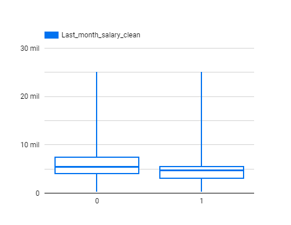
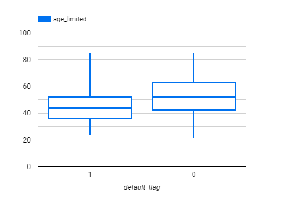
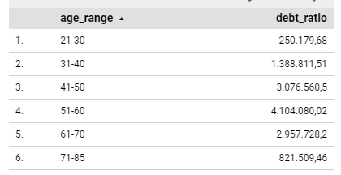
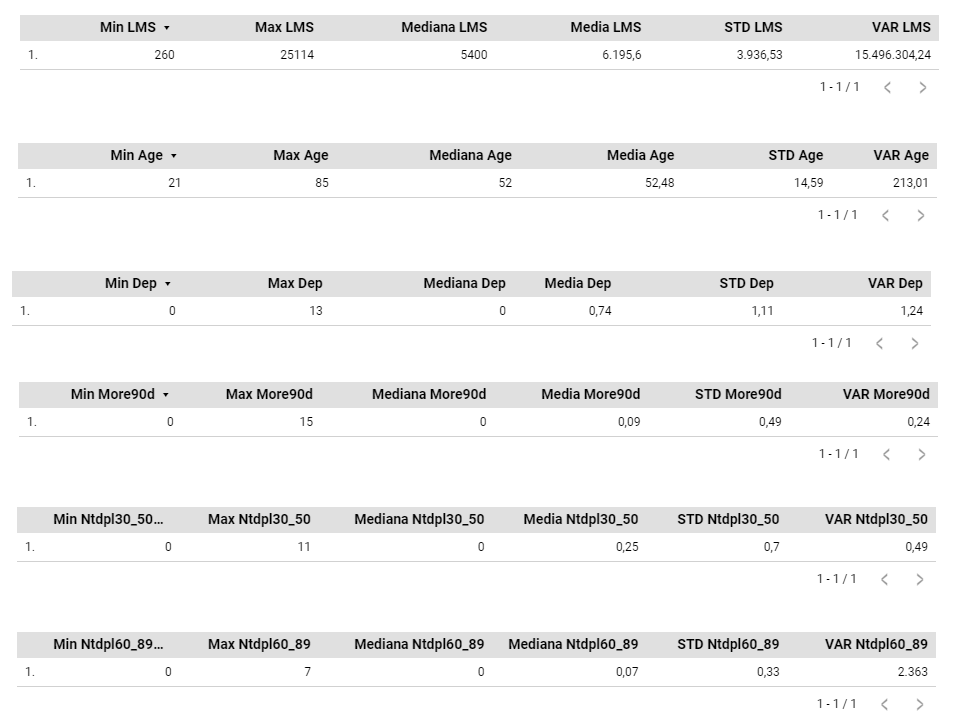
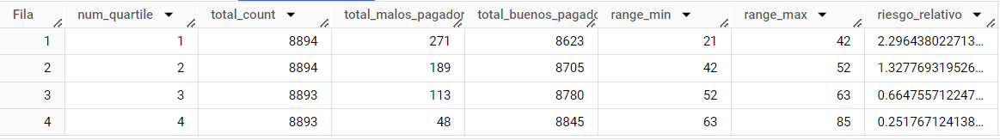
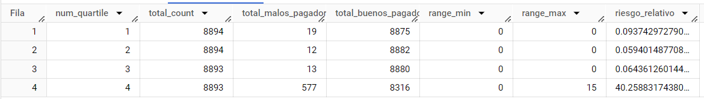
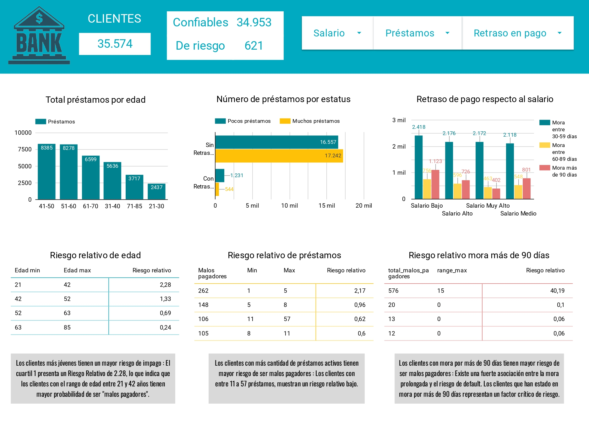

# Proyecto3-Riesgo Relativo
## Índice

- [1. Contexto](#contexto)
- [2. Objetivo](#objetivo)
- [3. Metodología](#metodología)
  [3.1 Procesamiento y preparación de datos](#procesamiento-y-preparación-de-datos)
- [3.2 Análisis exploratorio](#análisis-exploratorio)
- [3.3 Análisis de riesgo relativo](#análisis-de-riesgo-relativo)
- [4. Visualización de resultados](#visualización-de-resultados)
- [5. Conclusiones](#conclusiones)
- [6. Recomendaciones](#recomendaciones)
- [6. Enlaces de interés](#enlaces-de-interés)

## 1. Contexto: 

La disminución de las tasas de interés en el mercado ha desencadenado un aumento notable en la demanda de solicitudes de crédito, lo que ha llevado a una afluencia de solicitudes de préstamo en el banco “Super Caja”. El banco está enfocando sus esfuerzos en automatizar y mejorar la eficiencia en la identificación y mitigación de estos riesgos, asegurando un equilibrio entre crecimiento y seguridad financiera.

## 2. Objetivo:
En este proyecto se analizó el riesgo relativo en una base de datos de clientes de un banco, para la segmentación e identificación de posibles buenos y malos pagadores. El objetivo principal es mejorar la eficiencia y la precisión en la evaluación del riesgo crediticio, permitiendo al banco tomar decisiones informadas sobre la concesión de crédito y reducir el riesgo de préstamos no reembolsables.
## 3. Metodología:
  ## 3.1 Procesamiento y preparación de datos:
* 1. Herramientas:
Hojas de cálculo de Google
Gran consulta
Estudio Looker
ChatGPT
Lienzo
Presentaciones de Google
Telar
* 2. Idiomas:
SQL y BigQuery
* 3. Descripción de las fuentes de datos:
Este conjunto de tablas contiene información sobre préstamos concedidos a un grupo de clientes del banco, los cuales se dividen en:

* user_ info	

user_ id	Número de identificación del cliente (único para cada cliente)

age	Edad del cliente

sex	Sexo del cliente

last_ month_ salary	Último salario mensual que el cliente reportó al banco

number_dependents	Número de dependientes

* loans_ outstanding	

loan_ id	Número de identificación del préstamo (único para cada préstamo)

user_ id	Número de identificación del cliente

loan_ type	Tipo de préstamo (real estate = inmobiliario, others = otro)

* loans_ detail

user_ id	Número de identificación del cliente

more_ 90_ days_ overdue	Número de veces que el cliente estuvo más de 90 días vencido

using_ lines_ not_ secured_ personal_ assets	Cuánto está utilizando el cliente en relación con su límite de crédito, en líneas que no están garantizadas con bienes personales, como inmuebles y automóviles

number_ times_ delayed_ payment_ loan_ 30_ 59_ days	Número de veces que el cliente se retrasó en el pago de un préstamo (entre 30 y 59 días)

debt_ ratio	Relación entre las deudas y el patrimonio del prestatario. Ratio de deuda = Deudas / Patrimonio

number_ times_ delayed_ payment_ loan_ 60_ 89_ days	Número de veces que el cliente retrasó el pago de un préstamo (entre 60 y 89 días)

* default

user_ id	Número de identificación del cliente

default_ flag	Clasificación de los clientes morosos (1 para clientes que pagan mal, 0 para clientes que pagan bien)

* 4.Limpieza de datos:
* Conexión e Importación de Datos:
 - Importar datos y crear 4 tablas en Google BigQuery en el proyecto riesgo-relativo3

* Identificación de valores nulos, duplicados, fuera de rango o con caracteres extraños:

- Identificados y tratados 7,199 valores nulos en variable last_month_salary y 943 en number_dependents en la tabla user_info.
- Datos duplicados no afectan significativamente el análisis.
- Se identificaron valores inconsistentes en la variable categórica loan_type (mayúsculas y minúsculas mezcladas) de la tabla loans_outstanding. Se corrigieron estos valores utilizando LOWER y CASE para estandarizar las categorías.
- Se cambiaron los formatos de user_id de INTEGER a STRING para evitar problemas en el proceso de unión de tablas.
- Se utilizó la función CORR para evaluar la evaluación entre variables como:
  
  > En more_90_days_overdue y number_times_delayed_paid_loan_30_59_days , number_times_delayed_paid_loan_60_89_days y se identificó una limitación alta entre ellas, por lo que se comparó la desviación estándar de cada una. Al ver poca diferencia se dejan las tres variables para el análisis.
   
  > Variables Independientes: Se comprobó que deuda_ratio y more_90_days_overdue tenían una baja valoración, por lo que ambos se mantuvieron en el análisis, ya que proporcionaron información única.
  
  > Decisión sobre variables: Solo se excluyó la variable género , esto debido a que no es un factor determinante del riesgo crediticio, y su uso puede generar sesgos discriminatorios.

``` sql
SELECT 
    CORR(more_90_days_overdue, number_times_delayed_payment_loan_30_59_days) AS prueba_correlacion
FROM `riesgo-relativo3.dataset.loans_detail`;
--- 0.982916 alta correlación 
SELECT 
    CORR(more_90_days_overdue, number_times_delayed_payment_loan_60_89_days) AS corr_90_60_89,
    CORR(more_90_days_overdue, debt_ratio) AS corr_90_debt_ratio,
    CORR(number_times_delayed_payment_loan_30_59_days, debt_ratio) AS corr_30_59_debt_ratio,
    CORR(number_times_delayed_payment_loan_30_59_days, number_times_delayed_payment_loan_60_89_days) AS corr_30_59_60_89,
    CORR(debt_ratio, using_lines_not_secured_personal_assets) AS corr_debt_ratio_unsecured_lines
FROM `riesgo-relativo3.dataset.loans_detail`;
-- Desviación estándar para la variable more_90_days_overdue
SELECT 
    STDDEV_POP(more_90_days_overdue) AS stddev_pop_more_90_days_overdue,
    STDDEV_SAMP(more_90_days_overdue) AS stddev_samp_more_90_days_overdue,
    STDDEV(more_90_days_overdue) AS stddev_simple_more_90_days_overdue,
FROM 
    `riesgo-relativo3.dataset.loans_detail`;
SELECT
    STDDEV_SAMP(using_lines_not_secured_personal_assets)
FROM 
    `riesgo-relativo3.dataset.loans_detail`;   
-- Desviación estándar para la variable number_times_delayed_payment_loan_30_59_days
SELECT
    STDDEV_SAMP(number_times_delayed_payment_loan_30_59_days)
FROM 
    `riesgo-relativo3.dataset.loans_detail`;    
-- Desviación estándar para la variable debt_ratio
SELECT
    STDDEV_SAMP(debt_ratio),
FROM 
    `riesgo-relativo3.dataset.loans_detail`;
 
-- Desviación estándar para la variable number_times_delayed_payment_loan_60_89_days
SELECT
    STDDEV_SAMP(number_times_delayed_payment_loan_60_89_days)
FROM 
    `riesgo-relativo3.dataset.loans_detail`;
```

* Identificación y Tratamiento de valores atípicos: se utilizaron gráficos como histogramas y diagramas de caja (boxplots) en Looker Studio para identificar valores atípicos en variables clave como último_mes_salario y edad .





* Se aplicó la técnica estadística de winsorización, utilizando los percentiles P2 y P99 para reducir el impacto de los outliers sin eliminarlos. Se imputaron los valores extremos con los valores en estos percentiles, manteniendo así la representatividad de los datos cercanos a los extremos.
Pasos realizados:
 > Calcular percentiles P2 y P99 para last_month_salary .
 > Limitar el rango de edad a un máximo de 85 años para categorizar mejor a los clientes mayores, se crea la variable age_limited .
 > Imputar valores nulos en last_month_salary y number_dependents usando la mediana.

Consulta de winzorización
``` sql
WITH percentiles AS (
  SELECT
    PERCENTILE_CONT(last_month_salary, 0.02) OVER() AS S_P2,
    PERCENTILE_CONT(last_month_salary, 0.99) OVER() AS S_P99
  FROM
    `riesgo-relativo3.dataset.user_info`
  WHERE
    last_month_salary IS NOT NULL),
winsorized_data AS (
  SELECT
    CAST(a.user_id AS STRING) AS user_id,  
    a.age,
    CASE
      WHEN a.last_month_salary < p.S_P2 THEN p.S_P2
      WHEN a.last_month_salary > p.S_P99 THEN p.S_P99
      ELSE a.last_month_salary
    END AS lms_winsorized,
    a.number_dependents,
    b.default_flag,
    CASE 
      WHEN a.age BETWEEN 21 AND 30 THEN '21-30'
      WHEN a.age BETWEEN 31 AND 40 THEN '31-40'
      WHEN a.age BETWEEN 41 AND 50 THEN '41-50'
      WHEN a.age BETWEEN 51 AND 60 THEN '51-60'
      WHEN a.age BETWEEN 61 AND 70 THEN '61-70'
      WHEN a.age BETWEEN 71 AND 85 THEN '71-85'
      ELSE 'Outside Range'
    END AS age_range
  FROM
    `riesgo-relativo3.dataset.user_info` AS a
  LEFT JOIN
    `riesgo-relativo3.dataset.default` AS b
  ON
    a.user_id = b.user_id,
  (SELECT DISTINCT S_P2, S_P99 FROM percentiles) AS p)
SELECT
  user_id, 
  CASE 
    WHEN age > 85 THEN 85 
    ELSE age 
  END AS age_limited,
  age_range,
  IFNULL(lms_winsorized, 5400) AS last_month_salary_clean,
  IFNULL(number_dependents, 0) AS number_dependents_clean,
  default_flag
FROM
  winsorized_data;
```
* Creación de Nuevas Variables:

> Se generaron nuevas variables para agrupar los préstamos por cliente (user_id), incluyendo total_loans , real_state_loans y other_loans .

* Unión de Tablas:

Se unieron las tres tablas limpias ( user_default_view , loutstanding_view , ldetail_view ) mediante un INNER JOIN, dicha unión resultó en la exclusión de aproximadamente 425 registros que presentaban valores inconsistentes.
El proceso de unión resultó en una tabla consolidada con un total de 35,574 registros.

``` sql
SELECT
  u.user_id,
  u.age_limited,
  u.age_range,
  NTILE(4) OVER (ORDER BY u.age_limited) AS age_quartile,
  CASE
    WHEN NTILE(4) OVER (ORDER BY u.age_limited) = 1 THEN 'Edad de 21 a 42'
    WHEN NTILE(4) OVER (ORDER BY u.age_limited) = 2 THEN 'Edad de 43 a 56'
    WHEN NTILE(4) OVER (ORDER BY u.age_limited) = 3 THEN 'Edad de 57 a 70'
    WHEN NTILE(4) OVER (ORDER BY u.age_limited) = 4 THEN 'Edad de 71 a 85'
  END AS age_label,
  u.last_month_salary_clean,
  u.number_dependents_clean,
  u.default_flag,
  NTILE(4) OVER (ORDER BY o.total_loans) AS loans_quartile,
  CASE
    WHEN NTILE(4) OVER (ORDER BY o.total_loans) IN (1, 2) THEN 'Pocos préstamos'
    WHEN NTILE(4) OVER (ORDER BY o.total_loans) IN (3, 4) THEN 'Muchos préstamos'
  END AS loans_label,
  NTILE(4) OVER (ORDER BY ld.more_90_days_overdue) AS overdue_quartile,
  CASE
    WHEN NTILE(4) OVER (ORDER BY ld.more_90_days_overdue) IN (1, 2, 3) THEN 'Clientes sin mora'
    WHEN NTILE(4) OVER (ORDER BY ld.more_90_days_overdue) = 4 THEN 'Clientes con mora'
  END AS overdue_label,
  CASE
    WHEN u.default_flag = 1 THEN 'De riesgo'
    ELSE 'Confiable'
  END AS pagador_status,
  sc.salary_category,
  sc.salary_quartile,
  o.total_loans,
  o.other_loans,
  o.real_estate_loans,
  o.loan_category,
  ld.using_lines_not_secured_personal_assets,
  ld.more_90_days_overdue,
  CASE
    WHEN ld.more_90_days_overdue > 0 THEN 'Con Retrasos'
    ELSE 'Sin Retrasos'
  END AS overdue_category,
  ld.number_times_delayed_payment_loan_30_59_days,
  ld.number_times_delayed_payment_loan_60_89_days,
  ld.debt_ratio
FROM
  `riesgo-relativo3.dataset.user_default` AS u
INNER JOIN
  `riesgo-relativo3.dataset.salary_category` AS sc ON u.user_id = sc.user_id
INNER JOIN
  `riesgo-relativo3.dataset.loutstanding` AS o ON u.user_id = o.user_id
INNER JOIN
  `riesgo-relativo3.dataset.ldetail` AS ld ON u.user_id = ld.user_id
WHERE
  u.user_id != '21979'
ORDER BY
  u.user_id;
```

## 4. Visualización de resultados:

* Datos categóricos:
Se utilizaron tablas en Looker Studio para resumir y visualizar datos categóricos como age_range (rango de edad) y cat_debt_ratio (categorías de ratio de deuda).


* Cálculo de estadísticas descriptivas:
Se emplearon tablas dinámicas para calcular estadísticas descriptivas que facilitaran la comprensión de la distribución de los datos. Esto incluye medidas de tendencia central y dispersión para las variables categóricas.


* Incorporación de nuevas categorías:

Las categorías derivadas de los cuartiles fueron agregadas al conjunto de datos principal, permitiendo un análisis más detallado de los segmentos de clientes.

``` sql
WITH salary_groups AS (
    SELECT 
        user_id,
        last_month_salary_clean,
        NTILE(4) OVER (ORDER BY last_month_salary_clean) AS salary_quartile
    FROM 
        `riesgo-relativo3.dataset.user_default`)
SELECT 
    sg.user_id,
    sg.last_month_salary_clean,
    sg.salary_quartile,
    CASE
        WHEN sg.salary_quartile = 1 THEN 'Salario Bajo'
        WHEN sg.salary_quartile = 2 THEN 'Salario Medio'
        WHEN sg.salary_quartile = 3 THEN 'Salario Alto'
        WHEN sg.salary_quartile = 4 THEN 'Salario Muy Alto'
    END AS salary_category
FROM 
    salary_groups AS sg
```
* ANALISIS DE RIESGO RELATIVO
El riesgo relativo se calcula comparando la tasa de incidencia de un evento en un grupo expuesto a un factor de interés con la tasa de incidencia en un grupo no expuesto. En este caso, el objetivo es medir la probabilidad de que ocurra un evento (por ejemplo, el incumplimiento de pago) en los diferentes segmentos de clientes. 

En este análisis, se calculó el riesgo relativo para cada grupo de clientes (clasificados como mal pagador o bueno pagador) en función de diversas variables clave, utilizando la variable default_flag como indicador de comportamiento de pago. Este enfoque permite identificar qué variables están más asociadas con un mayor riesgo de incumplimiento y en qué segmentos es más probable que ocurra.

* Consulta de riesgo relativo

``` sql
WITH tabla_temporal AS (
  SELECT
    total_loans,
    default_flag
  FROM
    `riesgo-relativo3.dataset.consolidado`),
quartiles AS (
  SELECT
     total_loans,
    default_flag,
    NTILE(4) OVER (ORDER BY  total_loans) AS num_quartile
  FROM
    tabla_temporal),
quartile_risk AS (
  SELECT
    num_quartile,
    COUNT(*) AS total_count,
    SUM(default_flag) AS total_malos_pagadores,
    COUNT(*) - SUM(default_flag) AS total_buenos_pagadores
  FROM
    quartiles
  GROUP BY
    num_quartile),
quartile_ranges AS (
  SELECT
    num_quartile,
    MIN( total_loans) AS range_min,
    MAX( total_loans) AS range_max
  FROM
    quartiles
  GROUP BY
    num_quartile),
risk_relative AS (
  SELECT
    q.num_quartile,
    q.total_count,
    q.total_malos_pagadores,
    q.total_buenos_pagadores,
    r.range_min,
    r.range_max,
    (q.total_malos_pagadores / q.total_count) / (
      (SELECT SUM(total_malos_pagadores) FROM quartile_risk WHERE num_quartile <> q.num_quartile) /
      (SELECT SUM(total_count) FROM quartile_risk WHERE num_quartile <> q.num_quartile)
    ) AS riesgo_relativo
  FROM
    quartile_risk q
  JOIN
    quartile_ranges r
  ON
    q.num_quartile = r.num_quartile)
SELECT * FROM risk_relative
ORDER BY num_quartile;
```
* riesgo relativo para la variable edad



*  riesgo relativo para la variable total préstamos


* riesgo relativo para la variable more 90 días



* Creación de Dashboard en looker studio




## 5. Conclusiones:
* Comprobación de hipótesis
> Los más jóvenes tienen un mayor riesgo de impago : El cuartil 1 (Q1) presenta un Riesgo Relativo de 2.2795, lo que indica que los individuos en el rango de edad entre 21 y 42 años tienen probabilidad de ser "malos pagadores".

> Las personas con más cantidad de préstamos activos tienen mayor riesgo de ser malos pagadores : Los clientes en los cuartiles 1 y 2 (con entre 11 a 57 préstamos) muestran un riesgo relativo bajo.

> Las personas que han retrasado sus pagos por más de 90 días tienen mayor riesgo de ser malos pagadores : Existe una fuerte asociación entre la mora prolongada y el riesgo de default. Los clientes que han estado en mora por más de 90 días (Q4) representan un factor crítico de riesgo.

## 6. Recomendaciones:

> Implementar políticas de evaluación crediticia más estrictas para clientes más jóvenes, como mayores requisitos de ingresos o avales adicionales.

> Ofrecer productos específicos, como créditos con plazos más cortos o montos menores, para mitigar el riesgo.

> Mantener una política de préstamos flexible para personas con múltiples préstamos, siempre que se mantengan al día en sus pagos.

> Implementar programas de reestructuración de deuda o refinanciamiento, esto ayudaría a evitar que caigan en mora prolongada.


## 7. Enlaces de interés:
Dashboard en looker studio
https://lookerstudio.google.com/s/oOK5omn9DGE

Presentación en PPT
https://docs.google.com/presentation/d/1p1OnuKoQmD1V6TffBBuThOIGT05H2yyzLGgywPF1IHA/edit?usp=sharing

Presentación Loom
https://www.loom.com/share/d4e20c349c10461f90f82c7d7ad05480?sid=bf56efb5-b1e3-4f80-b300-7be59d64ff1f
